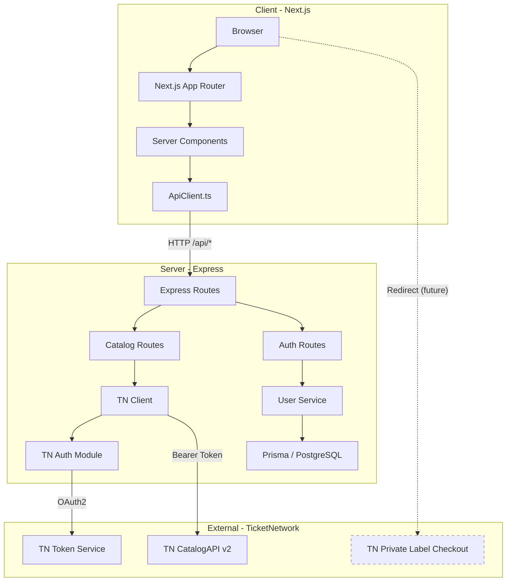

# Ticket Reselling Platform — Comprehensive Project Documentation

> **Last updated:** August 16, 2026  
> **Client:** Steven (third-party ticket reseller)  
> **Developer:** Mohammed Arif  
> **Account:** ZX7910-STORE · WCID 12498 · Sandbox environment

---

## 1. Project Overview

A ticket reselling website built for Steven that:
- Displays events, venues, categories, and performers sourced from **TicketNetwork's CatalogAPI**
- Redirects users to **TicketNetwork's hosted "Private Label" checkout** (they are Merchant of Record — handle payment, fulfillment, chargebacks, fraud)
- Steven earns a **markup-based commission**: sets markup over wholesale price; TicketNetwork retains 7.5% of wholesale; Steven earns the rest
- Supports **gift cards** as an independent feature (not applicable to TN checkout)
- User authentication system (signup/login/profile) independent of TicketNetwork

### Business Model (Confirmed by TicketNetwork — Aug 11, 2026)

| Aspect | Detail |
|---|---|
| Integration type | **Private Label (Option B)** — NOT Mercury/MoR |
| Catalog data | CatalogAPI (read-only, Sandbox working) |
| Checkout | Redirect to TN-hosted page (not embeddable/themeable) |
| Payment processing | TicketNetwork handles entirely |
| Fulfillment/delivery | TicketNetwork handles entirely |
| Order status | None returned to us post-checkout |
| Commission tracking | TN sales reporting dashboard (not API/webhook) |
| Pricing model | Wholesale + our markup. TN retains 7.5% of wholesale, we earn the rest |

**Example:** Wholesale $100 → 20% markup → Customer pays $120 → TN retains $7.50 → Our commission: $12.50

---

## 2. Tech Stack

| Layer | Technology | Status |
|---|---|---|
| Frontend | Next.js 16.2.6 (App Router, Turbopack) | ✅ Running |
| Styling | TailwindCSS + CSS custom properties (dark theme) | ✅ Configured |
| i18n | next-intl (en, fr) | ✅ Working |
| Backend | Express 4 + TypeScript | ✅ Running |
| Database | PostgreSQL + Prisma ORM | ✅ Migrated |
| Auth | JWT (bcryptjs + jsonwebtoken) | ✅ Working |
| API integration | TicketNetwork CatalogAPI v2 (OAuth2) | ✅ Working |
| Logging | Pino | ✅ Configured |
| Testing | Vitest + Supertest (server), Vitest (client) | ✅ Test suites exist |
| Rate limiting | express-rate-limit | ✅ Configured |

---

## 3. What Has Been Built ✅

### 3.1 Server (Express Backend)

#### TicketNetwork Integration Module
- [auth.ts](file:///c:/Users/workm/Desktop/ticket-resell/server/src/modules/ticketnetwork/auth.ts) — OAuth2 client credentials flow, token caching, proactive refresh, revocation
- [client.ts](file:///c:/Users/workm/Desktop/ticket-resell/server/src/modules/ticketnetwork/client.ts) — HTTP wrapper with auto-retry on 401 (fault code 900901)
- [catalog.ts](file:///c:/Users/workm/Desktop/ticket-resell/server/src/modules/ticketnetwork/catalog.ts) — Typed wrappers for CatalogAPI endpoints
- [types.ts](file:///c:/Users/workm/Desktop/ticket-resell/server/src/modules/ticketnetwork/types.ts) — TypeScript types for TN API responses

#### Catalog API Routes (`/api/catalog/*`)
| Endpoint | Server Route | Status |
|---|---|---|
| `GET /api/catalog/categories` | ✅ | Working |
| `GET /api/catalog/categories/*` | ✅ | Working |
| `GET /api/catalog/events` | ✅ | Working |
| `GET /api/catalog/events/search` | ✅ | Working |
| `GET /api/catalog/events/:id` | ✅ | Working |
| `GET /api/catalog/performers` | ✅ | Working |
| `GET /api/catalog/performers/:id` | ✅ | Working |
| `GET /api/catalog/venues` | ✅ | Working |
| `GET /api/catalog/venues/:id` | ✅ | Working |
| `GET /api/catalog/cities` | ✅ | Working |
| `GET /api/catalog/search/suggest` | ✅ | Working |

#### User Authentication Module
- [service.ts](file:///c:/Users/workm/Desktop/ticket-resell/server/src/modules/users/service.ts) — register, login, me, updateProfile, changePassword, deleteAccount
- [routes.ts](file:///c:/Users/workm/Desktop/ticket-resell/server/src/modules/users/routes.ts) — REST endpoints under `/api/auth/*`
- Zod validation on all inputs

| Endpoint | Method | Auth Required |
|---|---|---|
| `/api/auth/register` | POST | No |
| `/api/auth/login` | POST | No |
| `/api/auth/logout` | POST | No |
| `/api/auth/me` | GET | Yes |
| `/api/auth/profile` | PUT | Yes |
| `/api/auth/password` | PUT | Yes |
| `/api/auth/account` | DELETE | Yes |

#### Middleware
- [authenticate.ts](file:///c:/Users/workm/Desktop/ticket-resell/server/src/middleware/authenticate.ts) — JWT verification middleware
- [errorHandler.ts](file:///c:/Users/workm/Desktop/ticket-resell/server/src/middleware/errorHandler.ts) — Centralized error handling with custom `ApiError` class
- [rateLimiter.ts](file:///c:/Users/workm/Desktop/ticket-resell/server/src/middleware/rateLimiter.ts) — Rate limiting for catalog routes

#### Infrastructure
- Prisma ORM with PostgreSQL ([schema.prisma](file:///c:/Users/workm/Desktop/ticket-resell/server/prisma/schema.prisma))
- 2 migrations applied (init + user profile fields)
- Pino logger
- Environment validation with Zod ([env.ts](file:///c:/Users/workm/Desktop/ticket-resell/server/src/config/env.ts))

#### Tests (Server)
| Test File | Covers |
|---|---|
| `tests/health.test.ts` | Health endpoint |
| `tests/authenticate.test.ts` | JWT auth middleware |
| `tests/rateLimiter.test.ts` | Rate limiting |
| `tests/ticketnetwork/auth.test.ts` | TN OAuth2 flow |
| `tests/ticketnetwork/client.test.ts` | TN HTTP client |
| `tests/ticketnetwork/catalog.test.ts` | Catalog wrappers |
| `tests/ticketnetwork/routes.test.ts` | Catalog route handlers |
| `tests/users/service.test.ts` | User service logic |

---

### 3.2 Client (Next.js Frontend)

#### Pages Built

| Page | Route | Data Source |
|---|---|---|
| **Homepage** | `/[locale]` | Events, Categories, Performers, Cities from CatalogAPI |
| **Events listing** | `/[locale]/events` | Events with filters |
| **Event detail** | `/[locale]/events/[id]` | Single event by ID |
| **Artists listing** | `/[locale]/artists` | Performers from CatalogAPI |
| **Artist detail** | `/[locale]/artists/[id]` | Single performer by ID |
| **Venues listing** | `/[locale]/venues` | Venues from CatalogAPI |
| **Venue detail** | `/[locale]/venues/[id]` | Single venue by ID |
| **Category browse** | `/[locale]/categories/[...path]` | Category by path |
| **Search** | `/[locale]/search` | Event search |
| **Sign In** | `/[locale]/sign-in` | Local auth |
| **Sign Up** | `/[locale]/sign-up` | Local auth |
| **Forgot Password** | `/[locale]/forgot-password` | — |
| **Dashboard** | `/[locale]/dashboard` | User profile |
| **Dashboard / Profile** | `/[locale]/dashboard/profile` | User data |
| **Dashboard / Settings** | `/[locale]/dashboard/settings` | — |
| **Dashboard / Orders** | `/[locale]/dashboard/orders` | — |
| **Dashboard / Tickets** | `/[locale]/dashboard/tickets` | — |
| **Dashboard / Notifications** | `/[locale]/dashboard/notifications` | — |

#### Homepage Sections (matching Figma)
1. ✅ Hero Section (featured event + search bar)
2. ✅ Browse by Category
3. ✅ Events This Weekend
4. ✅ Popular Artists
5. ✅ Browse by City
6. ✅ Gift Card promo section
7. ✅ How It Works
8. ✅ Stats Section
9. ✅ Header with navigation
10. ✅ Footer with newsletter signup

#### Components Built
| Component | File |
|---|---|
| EventCard + Skeleton | `components/catalog/EventCard.tsx`, `EventCardSkeleton.tsx` |
| ArtistCard + Skeleton | `components/catalog/ArtistCard.tsx`, `ArtistCardSkeleton.tsx` |
| CategoryCard + Skeleton | `components/catalog/CategoryCard.tsx`, `CategoryCardSkeleton.tsx` |
| VenueCard | `components/catalog/VenueCard.tsx` |
| TicketRow | `components/catalog/TicketRow.tsx` |
| SearchBar | `components/catalog/SearchBar.tsx` |
| Pagination | `components/catalog/Pagination.tsx` |
| TabNav | `components/catalog/TabNav.tsx` |
| SectionHeading | `components/catalog/SectionHeading.tsx` |
| Header | `components/layout/Header.tsx` |
| Footer | `components/layout/Footer.tsx` |
| SignInForm | `components/SignInForm.tsx` |
| SignUpForm | `components/SignUpForm.tsx` |
| SignOutButton | `components/SignOutButton.tsx` |
| DashboardSidebar | `components/DashboardSidebar.tsx` |
| DashboardProfileForm | `components/DashboardProfileForm.tsx` |
| DashboardChangePasswordForm | `components/DashboardChangePasswordForm.tsx` |
| DashboardDeleteAccountButton | `components/DashboardDeleteAccountButton.tsx` |
| LocaleSwitcher | `components/LocaleSwitcher.tsx` |

#### Client Libraries
- [ApiClient.ts](file:///c:/Users/workm/Desktop/ticket-resell/client/src/libs/ApiClient.ts) — Server-side HTTP client (calls Express backend, auto-attaches JWT from cookies)
- [CatalogApi.ts](file:///c:/Users/workm/Desktop/ticket-resell/client/src/libs/CatalogApi.ts) — Typed CatalogAPI wrapper functions
- [Auth.ts](file:///c:/Users/workm/Desktop/ticket-resell/client/src/libs/Auth.ts) — Auth utilities
- [Env.ts](file:///c:/Users/workm/Desktop/ticket-resell/client/src/libs/Env.ts) — t3-env validated environment config
- I18n routing + navigation helpers

#### Design System
- Dark theme with CSS custom properties
- Brand color: `#ea2a43` (red)
- Fonts: Poppins (headings), Plus Jakarta Sans (body)
- Fully responsive (mobile-first breakpoints)
- Streaming with Suspense boundaries + skeleton loading states

---

### 3.3 Database Schema

| Table | Purpose | Status |
|---|---|---|
| `User` | Customer accounts (email, password, profile, role) | ✅ Migrated |
| `AdminUser` | Steven's admin account (separate from customers) | ✅ Migrated |
| `GiftCard` | Gift card code, balance, status, expiry | ✅ Migrated |
| `GiftCardRedemption` | Immutable financial records of redemptions | ✅ Migrated |
| `CachedCategory` | Cached TN category data | ✅ Migrated |
| `CachedEvent` | Cached TN event data | ✅ Migrated |
| `CachedPerformer` | Cached TN performer data | ✅ Migrated |
| `CachedVenue` | Cached TN venue data | ✅ Migrated |

> [!NOTE]
> No `orders`/`payments`/`commission_reports` tables — TicketNetwork owns all transaction data under the Private Label model.

---

## 4. What Is NOT Built Yet ❌

### 4.1 Critical / High Priority

| Item | Description | Blocked? |
|---|---|---|
| **Checkout redirect flow** | Pre-checkout UI → redirect to TN-hosted Private Label checkout page | ⛔ **Blocked on NDA signing** |
| **UTM/GTM attribution** | Pass UTM params + GTM tags in the checkout redirect for commission attribution | ⛔ Blocked on NDA + TN docs |
| **Gift card module (backend)** | CRUD routes, redemption logic, admin management | ❌ Not started (schema ready) |
| **Gift card purchase/redeem UI** | Frontend for buying, viewing, and redeeming gift cards | ❌ Not started |
| **Admin dashboard (Steven)** | Sales reporting — likely link/embed to TN's reporting dashboard | ❌ Not started |
| **Catalog caching layer** | Actually using the `Cached*` Prisma models to cache TN data and reduce API calls | ❌ Tables exist but no caching logic |
| **Forgot password flow** | Password reset with email (page exists, no backend logic) | ❌ Not started |
| **Email service** | Transactional emails (password reset, account verification, etc.) | ❌ Not started |

### 4.2 Medium Priority

| Item | Description |
|---|---|
| **Event detail page — ticket listings** | TicketRow component exists but no real ticket/pricing data integrated (pricing comes through TN Private Label, not CatalogAPI) |
| **Cart / pre-checkout UI** | Cart review page before the TN redirect |
| **Dashboard — Orders** | Page shell exists, no data (orders live in TN's system) |
| **Dashboard — Tickets** | Page shell exists, no data source |
| **Dashboard — Notifications** | Page shell exists, no notification system |
| **User profile — full CRUD** | Only displayName update works; no firstName/lastName/dateOfBirth/gender update endpoint |
| **Search — autocomplete/suggest** | Backend endpoint exists (`/suggest`), not wired to SearchBar UI |

### 4.3 Low Priority / Nice-to-Have

| Item | Description |
|---|---|
| **Production environment** | Separate env config, production TN API URLs, deployment pipeline |
| **Image/asset management** | Event/performer/venue images from TN API or uploaded assets |
| **SEO optimization** | Dynamic meta tags for event/performer/venue pages |
| **Performance monitoring** | Error tracking, APM, uptime monitoring |
| **CI/CD pipeline** | Automated testing, linting, deployment |
| **Rate limit strategy at scale** | Currently 60 req/min (Trial tier); need higher throughput for production |

---

## 5. CatalogAPI Endpoints — Implementation Coverage

### Implemented in Server ✅
| Endpoint | Server Route |
|---|---|
| `GET /categories` | `/api/catalog/categories` |
| `GET /categories/{path}` | `/api/catalog/categories/*` |
| `GET /events` | `/api/catalog/events` |
| `GET /events/search` | `/api/catalog/events/search` |
| `GET /events/{id}` | `/api/catalog/events/:id` |
| `GET /performers` | `/api/catalog/performers` |
| `GET /performers/{id}` | `/api/catalog/performers/:id` |
| `GET /venues` | `/api/catalog/venues` |
| `GET /venues/{id}` | `/api/catalog/venues/:id` |
| `GET /cities` | `/api/catalog/cities` |
| `GET /suggest` | `/api/catalog/search/suggest` |

### NOT Implemented (available in Swagger) ❌
| Endpoint | Notes |
|---|---|
| `GET /categoryhierarchies` | Full hierarchy tree — useful for nav menus |
| `GET /categoryhierarchies/{id}` | Single hierarchy by ID |
| `GET /cities/{id}` | Individual city lookup |
| `GET /cities/suggest` | City autocomplete |
| `GET /countries` | Country listing |
| `GET /countries/{code}` | Country by code |
| `GET /events/suggest` | Event autocomplete |
| `GET /events/bulk` | Bulk event fetch |
| `GET /performers/suggest` | Performer autocomplete |
| `GET /postalCodes` | Postal code listing |
| `GET /postalCodes/{id}` | Individual postal code |
| `GET /stateProvinces` | State/province listing |
| `GET /stateProvinces/{id}` | Individual state/province |
| `GET /venues/suggest` | Venue autocomplete |

> [!TIP]
> The suggest endpoints (`/events/suggest`, `/performers/suggest`, `/venues/suggest`, `/cities/suggest`) would significantly improve the SearchBar autocomplete experience.

---

## 6. Blockers & Open Questions

### Blockers ⛔

| # | Blocker | Impact | Action Required |
|---|---|---|---|
| 1 | **NDA not yet signed with TicketNetwork** | Cannot access Private Label checkout Sandbox → cannot build or test the checkout redirect flow | Contact Ian Schultz at IntegrationSupport@ticketnetwork.com to initiate NDA process |
| 2 | **No Production access** | Sandbox only — cannot launch | Requires NDA + separate production access request |

### Open Questions ❓

| # | Question | Impact |
|---|---|---|
| 1 | Where is markup/pricing configured — inside TN's Private Label platform or something we submit? | Determines if we need any pricing logic in our app |
| 2 | Sales reporting dashboard — per-account for Steven, or granted to us as integrator? | Determines how to surface commission data |
| 3 | Exact UTM parameter names/format TN expects for attribution | Needed before wiring the checkout redirect |
| 4 | GTM tag placement details for conversion tracking | Needed for analytics integration |
| 5 | Can gift cards apply toward TN-hosted checkout purchases? | Likely no (TN owns that page), but needs confirmation |
| 6 | Production access process and timeline | Planning for launch |

---

## 7. Figma Design Coverage

Based on the 32 UI design screenshots in `/ui-design/`:

| Figma Screen | Implementation Status |
|---|---|
| Home Page Nav & Hero | ✅ Built |
| Home Page Browse Category | ✅ Built |
| Home Page Events This Weekend | ✅ Built |
| Home Page Popular Artists | ✅ Built |
| Home Page Browse By City | ✅ Built |
| Home Page Gift Card Section | ✅ Built |
| Home Page How It Works | ✅ Built |
| Home Page Stats Section | ✅ Built |
| Home Page Footer | ✅ Built |
| Full Homepage composite | ✅ Built |
| Log In | ✅ Built |
| Sign Up | ✅ Built |
| Forgot Password | ⚠️ Page exists, no backend |
| Change Password | ✅ Built |
| Event Details (4 screens) | ⚠️ Partially — page exists, ticket listing/pricing incomplete |
| Artist Details (3 screens) | ⚠️ Partially — basic info shown, related events may be incomplete |
| User Dashboard (6 screens) | ⚠️ Partially — shell + profile page built, orders/tickets/notifications are empty shells |
| Checkout Process (3 screens) | ❌ Not built (blocked on NDA) |
| Gift Card Checkout (2 screens) | ❌ Not built |

---

## 8. Architecture Diagram



---

## 9. File Structure

```
ticket-resell/
├── client/                          # Next.js 16 frontend
│   ├── src/
│   │   ├── app/
│   │   │   ├── layout.tsx           # Root layout (html/body)
│   │   │   ├── [locale]/
│   │   │   │   ├── layout.tsx       # Locale layout (next-intl provider)
│   │   │   │   ├── (marketing)/     # Public pages
│   │   │   │   │   ├── page.tsx     # Homepage (8 sections)
│   │   │   │   │   ├── events/      # Events listing + detail
│   │   │   │   │   ├── artists/     # Artists listing + detail
│   │   │   │   │   ├── venues/      # Venues listing + detail
│   │   │   │   │   ├── categories/  # Category browse
│   │   │   │   │   └── search/      # Search results
│   │   │   │   └── (auth)/          # Auth-related pages
│   │   │   │       ├── (center)/    # sign-in, sign-up, forgot-password
│   │   │   │       └── dashboard/   # User dashboard (profile, settings, etc.)
│   │   │   └── api/                 # Next.js API routes
│   │   ├── components/
│   │   │   ├── catalog/             # 12 catalog-related components
│   │   │   ├── layout/              # Header, Footer
│   │   │   └── *.tsx                # Auth & dashboard components
│   │   ├── libs/                    # ApiClient, CatalogApi, Auth, Env, I18n
│   │   ├── locales/                 # en.json, fr.json
│   │   ├── styles/                  # global.css (design tokens)
│   │   └── types/                   # Catalog types, I18n types
│   └── .env                         # BACKEND_API_URL, JWT_SECRET
│
├── server/                          # Express backend
│   ├── src/
│   │   ├── app.ts                   # Express app setup
│   │   ├── server.ts                # Entry point (listen on PORT)
│   │   ├── config/                  # env.ts, constants.ts
│   │   ├── libs/                    # db.ts (Prisma), logger.ts (Pino)
│   │   ├── middleware/              # authenticate, errorHandler, rateLimiter
│   │   ├── modules/
│   │   │   ├── ticketnetwork/       # auth, client, catalog, types
│   │   │   └── users/               # routes, service
│   │   ├── routes/                  # index.ts, catalog.ts
│   │   └── types/                   # express.d.ts
│   ├── tests/                       # 8 test files
│   ├── prisma/
│   │   ├── schema.prisma            # 8 models, 3 enums
│   │   └── migrations/              # 2 migrations applied
│   └── .env                         # DB, JWT, TN credentials
│
├── ui-design/                       # 32 Figma screenshot PNGs
└── docs/                            # Project documentation
    ├── ticket-platform-context.md   # Full project context
    ├── conversation-*.md            # TN email thread
    ├── swagger.json                 # CatalogAPI Swagger spec (26 endpoints)
    ├── API+Authorization.pdf        # TN auth documentation
    └── API Client DevPortal Guide   # DevPortal setup guide
```

---

## 10. Recommended Next Steps (Priority Order)

### Immediate (no blockers)

1. **Build the gift card module** — Backend CRUD + redemption routes, admin endpoints, then frontend purchase/redeem UI. Schema is ready.
2. **Wire up search autocomplete** — Connect the `/api/catalog/search/suggest` endpoint to the `SearchBar` component for live suggestions.
3. **Implement catalog caching** — Use the `Cached*` Prisma models to store TN API responses, reducing API calls and staying within rate limits.
4. **Complete user profile CRUD** — Add firstName/lastName/dateOfBirth/gender to the profile update endpoint and form.
5. **Add suggest endpoints** — Implement `/events/suggest`, `/performers/suggest`, `/venues/suggest`, `/cities/suggest` for better autocomplete.
6. **Build pre-checkout cart UI** — Everything up to the redirect point (which will be wired once NDA is signed).

### Requires NDA (highest business priority)

7. **Sign the NDA** — Email Ian Schultz (IntegrationSupport@ticketnetwork.com). This unblocks the entire checkout flow.
8. **Implement checkout redirect** — Once Sandbox access is granted, wire the TN Private Label checkout redirect with UTM params.
9. **Configure GTM tags** — Set up conversion tracking per TN's specifications.

### Pre-Launch

10. **Production access** — Request from TN, configure production environment.
11. **Email service** — Password reset, account verification emails.
12. **CI/CD pipeline** — Automated testing + deployment.
13. **Monitoring & error tracking** — APM, logging, uptime checks.

---

## 11. Environment Configuration

### Server `.env` (required variables)
```env
DATABASE_URL=postgresql://...
JWT_SECRET=<32+ char secret>
JWT_EXPIRES_IN=7d
TN_CONSUMER_KEY=<from TN DevPortal>
TN_CONSUMER_SECRET=<from TN DevPortal>
TN_WCID=12498
TN_BASE_URL=https://sandbox.tn-apis.com/catalog/v2
TN_TOKEN_URL=https://key-manager.tn-apis.com/oauth2/token
TN_REVOKE_URL=https://key-manager.tn-apis.com/oauth2/revoke
PORT=8000
NODE_ENV=development
```

### Client `.env` (required variables)
```env
BACKEND_API_URL=http://localhost:8000
JWT_SECRET=<must match server JWT_SECRET>
```

> [!CAUTION]
> **Never** expose TN Consumer Key/Secret in the frontend. They must stay in the Express backend's `.env` only. Never use `NEXT_PUBLIC_` prefix for any sensitive credentials.

---

## 12. How to Run

```bash
# 1. Start PostgreSQL (must be running on port 5432)

# 2. Server
cd server
npm install
npx prisma migrate deploy    # Apply migrations
npm run dev                  # Starts on :8000

# 3. Client
cd client
npm install
npm run dev                  # Starts on :3000
```

---

## 13. Key Contacts

| Person | Role | Email |
|---|---|---|
| Ian Schultz | TN Integration Support | Ian.Schultz@ticketnetwork.com |
| Yuliya Biziuk | TN API Integration Lead | Yuliya.Biziuk@ticketnetwork.com |
| General | TN Support | IntegrationSupport@ticketnetwork.com |
